# YooMoney Payments SDK

[](https://img.shields.io/badge/Support-SDK%2021+-brightgreen.svg)
[](https://img.shields.io/github/v/tag/yoomoney/yookassa-android-sdk.svg?sort=semver)
[](https://img.shields.io/github/license/yoomoney/yookassa-android-sdk.svg)

This SDK allows processing payments using a payment token. It **works as an addition to the [YooMoney API](https://yookassa.ru/developers/payments/sdk-tokens)**.

The general payment process in the app is as follows:
- You start the process of [tokenization in the SDK](#tokenization);
- The user selects the payment method and enters the required data;
- The SDK exchanges this data for a payment token (`payment_token`) and returns it to you;
- After you receive `payment_token`, create a payment using the [API method](https://yookassa.ru/developers/api#create_payment);
- If necessary, launch the [payment confirmation](#payment-confirmation) process in the SDK using 3DS or SberPay.

**Tokenization and payment processes diagram:**

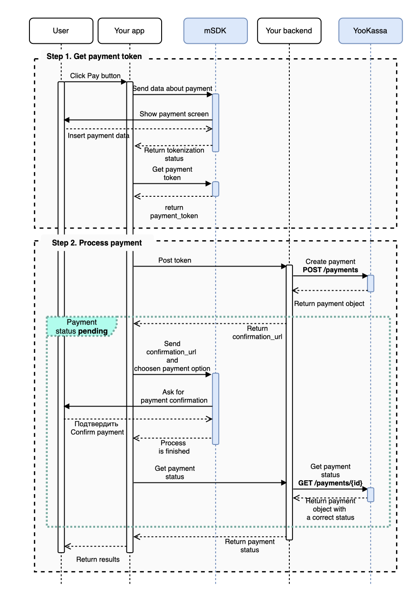

The SDK includes ready-made payment interfaces (payment form and everything related to it).

Using the SDK, you can receive tokens for processing payments from a bank card, Google Pay, Sberbank, or a YooMoney wallet.

This repository contains the SDK code and a sample app integrating it.
* [Library code](./library)
* [Code of the demo app that integrates the SDK](./sample)

# Documentation

Android Checkout mobile SDK - version $versionName ([changelog](https://github.com/yoomoney/yookassa-android-sdk/blob/master/CHANGELOG.md))

* [Changelog](#changelog)
* [Migration guide](#migration-guide)
* [Connection via Gradle](#connection-via-Gradle)
* [Integration recommendations](#integration-recommendations)
    * [App configuration for digital goods sales](#app-configuration-for-digital-goods-sales)
    * [Recommended compatible versions](#recommended-compatible-versions)
* [Library usage](#library-usage)
    * [Tokenization](#tokenization)
        * [Launching tokenization via all methods](#launching-tokenization-via-all-methods)
        * [Launching tokenization via YooMoney wallet](#launching-tokenization-via-YooMoney-wallet)
        * [Launching tokenization via SberPay](#launching-tokenization-via-SberPay)
        * [Launching tokenization via a bank card](#launching-tokenization-via-a-bank-card)
        * [Preparation for launching Google Pay tokenization](#preparation-for-launching-Google-Pay-tokenization)
        * [Launching Google Pay tokenization](#launching-Google-Pay-tokenization)
        * [Launching tokenization for saved bank cards](#launching-tokenization-for-saved-bank-cards)
        * [Getting tokenization results](#getting-tokenization-results)
    * [Payment confirmation](#payment-confirmation)
        * [SberPay](#sberpay)
        * [3DSecure](#3dsecure)
    * [Linked card](#linked-card)
    * [Recurring payments](#recurring-payments)
    * [Logging and mock mode configuration](#logging-and-mock-mode-configuration)
        * [Logging enabling](#logging-enabling)
        * [Mock mode configuration](#configuring-mock-mode-configuration)
    * [Interface configuration](#interface-configuration)
    * [Scanning a bank card](#scanning-a-bank-card)
* [Useful links](#useful-links)

# Changelog

[Link to Changelog](https://github.com/yoomoney/yookassa-android-sdk/blob/master/CHANGELOG.md)

# Migration guide

[Link to Migration guide](https://github.com/yoomoney/yookassa-android-sdk/blob/master/MIGRATION.md)

# Connection via Gradle

To connect the library, add the dependencies to the build.gradle of the module:

```groovy
repositories {
    mavenCentral()
}

dependencies {
    implementation 'ru.yoomoney.sdk.kassa.payments:yookassa-android-sdk:6.5.0'
}
```

You also need to connect the kotlin plugin. To do so, add the following block of code to the build.gradle file of the root directory:

```groovy
buildscript {
    dependencies {
        classpath "org.jetbrains.kotlin:kotlin-gradle-plugin:1.5.31"
    }
}
```

In app, add the module to the build.gradle file:

```groovy
plugin {
    id 'kotlin-android'
}

```

# Integration recommendations

## App configuration for digital goods sales

If your app sells digital goods, you need to exclude Google Pay from the list of payment methods.
To do so, add the following code to AndroidManifest:

```xml
<meta-data
    android:name="com.google.android.gms.wallet.api.enabled"
    tools:node="remove" />
```


## Recommended compatible versions

Minimum supported Android SDK version: 21 (Android 5.0).

For the library to work correctly, you should use the following:
- Kotlin version 1.4.32;
- targetSdkVersion 31;
- Gradle version 7.0.+.

# Library usage

## Tokenization

The tokenization process is the exchange of payment data for a payment token (`payment_token`). This token is then used for creating a payment [via the API method](https://yookassa.ru/developers/api#create_payment)

The `Checkout.createTokenizeIntent()` method is used for starting the tokenization process. The method returns `Intent` which should be launched in `startActivityForResult()`. After that, the process will be controlled by the SDK.
The created payment token can be obtained in `onActivityResult()`

Mandatory method parameters:
- context (Context) - context of the app;
- paymentParameters (PaymentParameters) - parameters of the payment.

Optional method parameters:
- testParameters (TestParameters) - parameters for the test mode - enable logging/use mock data (see [Logging and mock mode configuration](#logging-and-mock-mode-configuration));
- uiParameters (UiParameters) - interface configuration (see [Interface configuration](#interface-configuration))

`PaymentParameters` fields:

Mandatory:
- amount (Amount) - cost of goods. Accepted payment methods may vary depending on this setting. This option will be displayed on the screen of the selected payment method in the process of tokenization via the selected payment method;
- title (String) - product name. This option will be displayed on the screen of the selected payment method in the process of tokenization via the selected payment method;
- subtitle (String) - product description. This option will be displayed on the screen of the selected payment method in the process of tokenization via the selected payment method;
- clientApplicationKey (String) - key for client apps from the YooMoney Merchant Profile ([Settings section — API Keys](https://yookassa.ru/my/api-keys-settings));
- shopId (String) - ID of the store in YooMoney ([Organization section](https://yookassa.ru/my/company/organization) - copy shopId from the required store);
- savePaymentMethod (SavePaymentMethod) - settings for saving the payment method. Saved payment methods can be used for recurring payments, (see [Recurring payments](#recurring-payments)).

Optional:
- paymentMethodTypes (Set of PaymentMethodType) - restrictions on payment methods. If you leave the field empty or specify null in it, the library will use all available payment methods, (see [Launching tokenization via all methods](#launching-tokenization-via-all-methods));
- gatewayId (String) - gatewayId for the store, (see [Launching Google Pay tokenization](#launch-tokenization-Google-Pay));
- customReturnUrl (String) - url of the page (only https is supported) that the user should be returned to after completing 3ds. Must be used only when own Activity for the 3ds url is used, (see [3DSecure](#3dsecure));
- userPhoneNumber (String) - user's phone number for payments via SberPay, (see [Launching tokenization via SberPay](#launching-tokenization-via-SberPay));
- googlePayParameters (GooglePayParameters) - settings for payments via Google Pay, (see [Launching Google Pay tokenization](#launch-tokenization-Google-Pay));
- authCenterClientId (String) - unique ID of the app for tokenization via YooMoney. (See [Launching tokenization via YooMoney wallet](#launching-tokenization-via-YooMoney-wallet))

`Amount` class fields:
- value (BigDecimal) - amount;
- currency (Currency) - currency.

`SavePaymentMethod` values:
- ON - Save the payment method for recurring payments. Only payment methods that support saving will be available to the user. During the first payment, a notification stating that the payment method will be saved will appear on the screen of the selected payment method.
- OFF - Do not save the payment method.
- USER_SELECTS - The user chooses whether or not to save the payment method. If the method can be saved, a toggle will appear on the selected payment method screen.
  You can read more about recurring payments in the [Recurring payments](#recurring-payments) section.

`PaymentMethodType` values:
- YOO_MONEY - payment was made from a YooMoney wallet;
- BANK_CARD - payment was made from a bank card;
- SBERBANK - payment was made via Sberbank (text message invoicing or SberPay);
- GOOGLE_PAY - payment was made via Google Pay.

Fields of the `GooglePayParameters` class:
- allowedCardNetworks (Set of GooglePayCardNetwork) - payment systems that allow for payments via Google Pay.

`GooglePayCardNetwork` values:
- AMEX
- DISCOVER
- JCB
- MASTERCARD
- VISA
- INTERAC
- OTHER

### Launching tokenization via all methods

To launch tokenization via all available payment methods, call the `createTokenizeIntent` method with the specified `PaymentParameters` object that contains the set of all payment methods, or do not include this set.

**Option 1**:

<details open>
  <summary>Kotlin</summary>

  ```kotlin
  class MyActivity : AppCompatActivity() {

      fun startTokenize() {
          val paymentParameters = PaymentParameters(
              amount = Amount(BigDecimal.TEN, Currency.getInstance("RUB")),
            title = "Product name",
            subtitle = "Product description",
            clientApplicationKey = "live_thisKeyIsNotReal", // key for client apps from the YooMoney Merchant Profile
            shopId = "12345", // ID of the store in the YooMoney system
            savePaymentMethod = SavePaymentMethod.OFF, // flag of the disabled option to save payment methods,
            paymentMethodTypes = setOf(PaymentMethodType.YOO_MONEY, PaymentMethodType.BANK_CARD, PaymentMethodType.SBERBANK, PaymentMethodType.GOOGLE_PAY), // the full list of available payment methods has been provided
            gatewayId = "gatewayId", // gatewayId of the store for Google Pay payments (required if payment methods include Google Pay)
            customReturnUrl = "https://custom.redirect.url", // url of the page (only https is supported) that the user should be returned to after completing 3ds.
            userPhoneNumber = "+79041234567", // user's phone number for autofilling the user phone number field in SberPay. Supported data format: "+7XXXXXXXXXX"
            authCenterClientId = "example_authCenterClientId" // ID received upon registering the app on the https://yookassa.ru website
            )
            val intent = createTokenizeIntent(this, paymentParameters)
            startActivityForResult(intent, REQUEST_CODE_TOKENIZE)
        }
    }
    ```
    </details>

    <details>
      <summary>Java</summary>

      ```java
      class MyActivity extends AppCompatActivity {

          void startTokenize() {
              Set<PaymentMethodType> paymentMethodTypes = new HashSet<PaymentMethodType>(){{
                  add(PaymentMethodType.SBERBANK); // selected payment method - SberPay
            add(PaymentMethodType.YOO_MONEY); // selected payment method - YooMoney
            add(PaymentMethodType.BANK_CARD); // selected payment method - Bank card
            add(PaymentMethodType.GOOGLE_PAY); // selected payment method - Google Pay
          }};
          PaymentParameters paymentParameters = new PaymentParameters(
                  new Amount(BigDecimal.TEN, Currency.getInstance("RUB")),
                  "Product name",
                  "Product description",
                  "live_thisKeyIsNotReal", // key for client apps from the YooMoney Merchant Profile
                  "12345", // ID of the store in the YooMoney system
                  SavePaymentMethod.OFF, // flag of the disabled option to save payment methods
                  paymentMethodTypes, // the full list of available payment methods has been provided
                  "gatewayId", // gatewayId of the store for Google Pay payments (required if payment methods include Google Pay)
                  "https://custom.redirect.url", //  url of the page (only https is supported) that the user should be returned to after completing 3ds. Must be used only when own Activity for the 3ds url is used.
                  userPhoneNumber = "+79041234567", // user's phone number for autofilling the user phone number field in SberPay. Supported data format: "+7XXXXXXXXXX"
                  null, // settings for tokenization via GooglePay,
                  "example_authCenterClientId" // ID received upon registering the app on the https://yookassa.ru website
          );
          Intent intent = Checkout.createTokenizeIntent(this, paymentParameters);
          startActivityForResult(intent, REQUEST_CODE_TOKENIZE);
      }
  }
  ```
  </details>

**Option 2**:

<details open>
  <summary>Kotlin</summary>

```kotlin
class MyActivity : AppCompatActivity() {

    fun startTokenize() {
        val paymentParameters = PaymentParameters(
            amount = Amount(BigDecimal.TEN, Currency.getInstance("RUB")),
            title = "Product name",
            subtitle = "Product Description",
            clientApplicationKey = "live_thisKeyIsNotReal", // key for client apps from the YooMoney Merchant Profile (https://yookassa.ru/my/api-keys-settings)
            shopId = "12345", // ID of the store in the YooMoney system
            savePaymentMethod = SavePaymentMethod.OFF, // flag of the disabled option to save payment methods,
            authCenterClientId = "example_authCenterClientId", // ID received upon registering the app on the https://yookassa.ru website
            gatewayId = "gatewayId", // gatewayId of the store for Google Pay payments (required if payment methods include Google Pay)
            customReturnUrl = "https://custom.redirect.url", // url of the page (only https is supported) that the user should be returned to after completing 3ds. Must be used only when own Activity for the 3ds url is used.
            userPhoneNumber = "+79041234567", // user's phone number for autofilling the user phone number field in SberPay. Supported data format: "+7XXXXXXXXXX"
            )
            val intent = createTokenizeIntent(this, paymentParameters)
            startActivityForResult(intent, REQUEST_CODE_TOKENIZE)
        }
    }
    ```
    </details>

    <details>
      <summary>Java</summary>

      ```java
      class MyActivity extends AppCompatActivity {

          void startTokenize() {
              PaymentParameters paymentParameters = new PaymentParameters(
                      new Amount(BigDecimal.TEN, Currency.getInstance("RUB")),
                      "Product name",
                      "Product Description",
                      "live_thisKeyIsNotReal", // key for client apps from the YooMoney Merchant Profile
                      "12345", // ID of the store in the YooMoney system
                      SavePaymentMethod.OFF, // flag of the disabled option to save payment methods
                      null, // the full list of available payment methods has been provided
                      "gatewayId", // gatewayId of the store for Google Pay payments (required if payment methods include Google Pay)
                      "https://custom.redirect.url", // url of the page (only https is supported) that the user should be returned to after completing 3ds. Must be used only when own Activity for the 3ds url is used.
                      "+79041234567", // user's phone number for autofilling the user phone number field in SberPay. Supported data format: "+7XXXXXXXXXX".
                      null, // settings for tokenization via GooglePay,
                      "example_authCenterClientId" // ID received upon registering the app on the https://yookassa.ru website
              );
              Intent intent = Checkout.createTokenizeIntent(this, paymentParameters);
              startActivityForResult(intent, REQUEST_CODE_TOKENIZE);
          }
      }
      ```
      </details>

**Processed results of the tokenization process are contained in the** [Get tokenization results](#get-tokenization-results) **section**


### Launching tokenization via YooMoney wallet

> If the payment methods include the YooMoney wallet, you will need to register the app and obtain `authCenterClientId`.
In other cases, this step can be skipped.

If you have already registered an app for **oAuth-authorization**, you can find the list of your apps at https://yookassa.ru/oauth/v2/client
If you have not yet registered an app for **oAuth-authorization**, follow the instructions below.
1. To register a new app, sign in at https://yookassa.ru
2. After signing in, navigate to the app registration page - https://yookassa.ru/oauth/v2/client
3. Click the Create app button and set the values for the parameters:
    * Name;
    * Description (optional);
    * Link to website;
    * Callback URL (any value; you can specify the link to the website);
    * Accesses. This includes three sections: `YooMoney API`, `YooMoney wallet`, `YooMoney profile`.
        * In the `YooMoney wallet` section, give permission to view the balance of the user's wallet. To do so, check the box next to the **View** field in the **WALLET BALANCE** section;
        * Open the `YooMoney profile` section and give permission to view the user's phone number, email, name, and avatar. To do so, check the box next to the **View** field in the **USER PHONE NUMBER, EMAIL, NAME, AND AVATAR** section;
3. Click or tap the "Register" button and complete the registration;
4. Information about the registered app will appear in the opened window. You will need `authCenterClientId` to launch tokenization;

<details open>
<summary>Kotlin</summary>

```kotlin
class MyActivity : AppCompatActivity() {

    fun startYooMoneyTokenize() {
        val paymentParameters = PaymentParameters(
            amount = Amount(BigDecimal.TEN, Currency.getInstance("RUB")),
            title = "Product name",
            subtitle = "Product Description",
            clientApplicationKey = "live_thisKeyIsNotReal", // key for client apps from the YooMoney Merchant Profile (https://yookassa.ru/my/api-keys-settings)
            shopId = "12345", // ID of the store in the YooMoney system
            savePaymentMethod = SavePaymentMethod.OFF, // flag of the disabled option to save payment methods,
            paymentMethodTypes = setOf(PaymentMethodType.YOO_MONEY), // selected payment method: YooMoney wallet
            authCenterClientId = "example_authCenterClientId" // ID received upon registering the app on the https://yookassa.ru website
        )
        val intent = createTokenizeIntent(this, paymentParameters)
        startActivityForResult(intent, REQUEST_CODE_TOKENIZE)
    }
}
```
</details>

<details>
  <summary>Java</summary>

  ```java
  class MyActivity extends AppCompatActivity {

      void startYooMoneyTokenize() {
          Set<PaymentMethodType> paymentMethodTypes = new HashSet<>();
          PaymentParameters paymentParameters = new PaymentParameters(
                  new Amount(BigDecimal.TEN, Currency.getInstance("RUB")),
                  "Product name",
                  "Product description",
                  "live_thisKeyIsNotReal", // key for client apps from the YooMoney Merchant Profile (https://yookassa.ru/my/api-keys-settings)
                  "12345", // ID of the store in the YooMoney system
                  SavePaymentMethod.OFF, // flag of the disabled option to save payment methods
                  paymentMethodTypes.add(PaymentMethodType.YOO_MONEY), // selected payment method: YooMoney wallet,
                  null, // gatewayId of the store for Google Pay payments (required if payment methods include Google Pay)
                  null, // url of the page (only https is supported) that the user should be returned to after completing 3ds. Must be used only when own Activity for the 3ds url is used.
                  null, // user's phone number for autofilling the user phone number field in SberPay. Supported data format: "+7XXXXXXXXXX"
                  null, // settings for tokenization via GooglePay,
                  "example_authCenterClientId" // authCenterClientId: ID received upon registering the app on the https://yookassa.ru website
          );
          Intent intent = Checkout.createTokenizeIntent(this, paymentParameters);
          startActivityForResult(intent, REQUEST_CODE_TOKENIZE);
      }
  }
  ```
  </details>

**Processed results of the tokenization process are contained in the** [Get tokenization results](#get-tokenization-results) **section**


### Launching tokenization via SberPay

Payments via SberPay allow for two user scenarios:
- Payment via the Sberbank Online mobile app;
- Payment by phone number (without the Sberbank Online mobile app);

To provide the option of paying via the Sberbank Online mobile app to your users, specify the unique scheme from your app's deep link.
The unique deep link scheme is what you specify as the scheme in your deep links. For example, in the `exampleapp://some.path` deep link, `exampleapp` is the scheme of your app.

To add a unique deep link scheme, insert the `resValue "string", "ym_app_scheme", "exampleapp"` line to the android.defaultConfig block in your build.gradle file
```
android {
    defaultConfig {
        resValue "string", "ym_app_scheme", "exampleapp"
    }
}
```
Or insert a line like this to your strings.xml:
```
<resources>
    <string name="ym_app_scheme" translatable="false">exampleapp</string>
</resources>
```
Where `exampleapp` is your app's unique deep link scheme (substitute this example for your scheme).
If you are already processing some deep links in your app, you can use the ready-made scheme of your app.
If you have not processed deep links in the projec beforet, you can create a unique scheme for your app (it must consist of Latin characters).

**Launching tokenization via SberPay looks like this.**

<details open>
  <summary>Kotlin</summary>

```kotlin
class MyActivity: Activity() {

    private fun startSberPayTokenize() {
        val paymentParameters = PaymentParameters(
            amount = Amount(BigDecimal.valueOf(10.0), Currency.getInstance("RUB")),
            title = "Product name",
            subtitle = "Product Description",
            clientApplicationKey = "live_thisKeyIsNotReal", // key for client apps from the YooMoney Merchant Profile (https://yookassa.ru/my/api-keys-settings)
            shopId = "12345", // ID of the store in the YooMoney system
            savePaymentMethod = SavePaymentMethod.OFF, // flag of the disabled option to save payment methods
            paymentMethodTypes = setOf(PaymentMethodType.SBERBANK), // selected payment method: SberPay
            userPhoneNumber = "+79041234567", // user's phone number for autofilling the user phone number field in SberPay. Supported data format: "+7XXXXXXXXXX"
        )
        val intent = createTokenizeIntent(this, paymentParameters)
        startActivityForResult(intent, REQUEST_CODE_TOKENIZE)
    }
}
```
</details>

<details>
  <summary>Java</summary>

```java
public class MyActivity extends Activity {

    private void startSberPayTokenize() {
        Set<PaymentMethodType> paymentMethodTypes = new HashSet<PaymentMethodType>(){{
            add(PaymentMethodType.SBERBANK); // selected payment method: SberPay
        }};
        paymentMethodTypes.add(PaymentMethodType.SBERBANK);
        PaymentParameters paymentParameters = new PaymentParameters(
                new Amount(BigDecimal.valueOf(10.0), Currency.getInstance("RUB")),
                "Product name",
                "Product Description",
                "live_thisKeyIsNotReal", // key for client apps from the YooMoney Merchant Profile (https://yookassa.ru/my/api-keys-settings)
                "12345", // ID of the store in the YooMoney system
                SavePaymentMethod.OFF, // flag of the disabled option to save payment methods
                paymentMethodTypes, // selected payment method: SberPay,
                null, // gateway of the store for Google Pay payments (required if payment methods include Google Pay)
                null, // url of the page (only https is supported) that the user should be returned to after completing 3ds. Must be used only when own Activity for the 3ds url is used.
                "+79041234567" // user's phone number for autofilling the user phone number field in SberPay. Supported data format: "+7XXXXXXXXXX"
        );
        Intent intent = Checkout.createTokenizeIntent(this, paymentParameters);
        startActivityForResult(intent, REQUEST_CODE_TOKENIZE);
    }
}
```
</details>

**Processed results of the tokenization process are contained in the** [Get tokenization results](#get-tokenization-results) **section**


### Launching tokenization via a bank card

To launch tokenization via just a bank card, specify `setOf(PaymentMethodType.BANK_CARD)` in `PaymentParameters`:

<details open>
  <summary>Kotlin</summary>

```kotlin
class MyActivity : AppCompatActivity() {

    fun startBankCardTokenize() {
        val paymentParameters = PaymentParameters(
            amount = Amount(BigDecimal.TEN, Currency.getInstance("RUB")),
            title = "Product name",
            subtitle = "Product description",
            clientApplicationKey = "live_thisKeyIsNotReal", // key for client apps from the YooMoney Merchant Profile (https://yookassa.ru/my/api-keys-settings)
            shopId = "12345", // ID of the store in the YooMoney system
            savePaymentMethod = SavePaymentMethod.OFF, // flag of the disabled option to save payment methods,
            paymentMethodTypes = setOf(PaymentMethodType.BANK_CARD) // selected payment method: bank card
        )
        val intent = createTokenizeIntent(this, paymentParameters)
        startActivityForResult(intent, REQUEST_CODE_TOKENIZE)
    }
}
```
</details>

<details>
  <summary>Java</summary>

```java
class MyActivity extends AppCompatActivity {

    void startBankCardTokenize() {
        Set<PaymentMethodType> paymentMethodTypes = new HashSet<>();
        PaymentParameters paymentParameters = new PaymentParameters(
                new Amount(BigDecimal.TEN, Currency.getInstance("RUB")),
                "Product name",
                "Product description",
                "live_thisKeyIsNotReal", // key for client apps from the YooMoney Merchant Profile (https://yookassa.ru/my/api-keys-settings)
                "12345", // ID of the store in the YooMoney system
                SavePaymentMethod.OFF, // flag of the disabled option to save payment methods
                paymentMethodTypes.add(PaymentMethodType.BANK_CARD) // selected payment method: bank card
        );
        Intent intent = Checkout.createTokenizeIntent(this, paymentParameters);
        startActivityForResult(intent, REQUEST_CODE_TOKENIZE);
    }
}
```
</details>

**Processed results of the tokenization process are contained in the** [Get tokenization results](#get-tokenization-results) **section**


### Preparation for launching Google Pay tokenization

Before launching Google Pay tokenization, you need to prepare the app and complete integration with the Google Pay API.

#### Preparing the Google Play Console

For payments via Google Pay to work properly in the production environment, make sure that:
- You have a developer account in the developer console: https://play.google.com/console
- An app has been created in the developer console;
- Your app is signed with a release key and uploaded to the developer console;

#### Preparing a profile in the Google Pay Business Console

Once you've completed the steps in the [Preparing the Google Play Console](#preparing-the-hoogle-play-console) section, set up your profile in the Google Pay Business Console:
- Visit the site: https://pay.google.com/business/console;
- Fill in all the information required for a company profile;
- After filling out the company profile, send it for verification by the Google Pay Business Console team;
- Wait until the company profile is verified by the Google Pay Business Console team.

#### Integrating the app with the Google Pay API

If you've completed all of the steps listed above, start integrating the Google Pay API:
- Visit the Google Pay Business Console website: https://pay.google.com/business/console;
- Navigate to the Google Pay API tab;
- Find the "Integration with your Android app" block;
- Find your app that you want to complete integration for in this block and click "Manage". If your app is not listed, follow the instructions in the [Preparing the Google Play Console](#preparing-the-hoogle-play-console) section;
- In the following window, select the type of integration through the gateway;
- Upload screenshots of the purchase process. The process of creating these screenshots is detailed in the [Preparing screenshots of the purchase process for the Google Pay API](#preparing-screenshots-of-the-purchase-process-for-Google-Pay-API) section;
- Send the form for review.
- After integration is verified and confirmed, the release-ready app will start working with payments via Google Pay.
- If integration was rejected, make corrections in accordance with the comments and resubmit the form.

#### Preparing screenshots of the purchase process for the Google Pay API

To fill out the form in the [Integrating the app with the Google Pay API](#Integrating-the-app-with-the-Google-Pay-API) section, you will need screenshots of the payment process.
That includes screenshots of several steps, with examples shown below.
> Sample screenshots below are provided as examples, do not use them when filling out the form. You ill need to create similar screenshots from your app.

| Product screen                               | Screen with payment methods | Screen for payment via Google Pay | Successful payment screen |
| -------------                              | ----- | ----- | ----- |
| 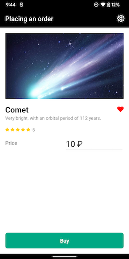 | 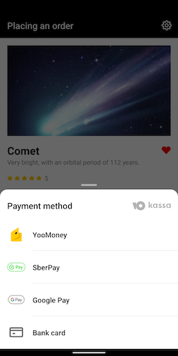 | 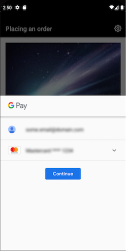 | 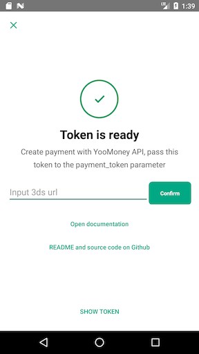 |

We propose using the sdk mock mode to take screenshots of the entire payment process. This is the mode where the sdk doesn't make any real requests to the server using previously prepared data instead.
- To do so, launch tokenization with all the payment methods you're planning to use.
- For the `testParameters` parameter, specify `googlePayTestEnvironment = true` and `mockConfiguration = MockConfiguration()`<br/>

`googlePayTestEnvironment` is responsible for the environment that Google Pay will work in.
- If you specify `googlePayTestEnvironment = true`, a test environment will be used (you can find out more at https://developers.google.com/pay/api/android/guides/test-and-deploy/integration-checklist)
- If you specify `googlePayTestEnvironment = false`, or don't specify the parameter at all, the production environment will be used.
> **Please note** if you specify `googlePayTestEnvironment = true`, then tokenization in the sdk itself will not work.

Below are examples of code with the launch of tokenization for taking screenshots of the payment process via Google Pay

<details open>
  <summary>Kotlin</summary>

```kotlin
class MyActivity: Activity() {

    private fun startSberPayTokenize() {
        val paymentParameters = PaymentParameters(
            amount = Amount(BigDecimal.valueOf(10.0), Currency.getInstance("RUB")),
            title = "Product name",
            subtitle = "Product Description",
            clientApplicationKey = "live_thisKeyIsNotReal", // key for client apps from the YooMoney Merchant Profile (https://yookassa.ru/my/api-keys-settings)
            shopId = "12345", // ID of the store in the YooMoney system
            savePaymentMethod = SavePaymentMethod.OFF, // flag of the disabled option to save payment methods
            authCenterClientId = "example_authCenterClientId" // ID received upon registering the app on the https://yookassa.ru website
        )
        val intent = createTokenizeIntent(
            context = this,
            paymentParameters = paymentParameters,
            testParameters = TestParameters(
                showLogs = true,// showLogs - enable/disable display of SDK logs
                googlePayTestEnvironment = true,// googlePayTestEnvironment - what type of environment should be used for Google Pay, test or production. Learn more at https://developers.google.com/pay/api/android/guides/test-and-deploy/integration-checklist
                mockConfiguration = MockConfiguration()//Enabling mock mode
            )
        )
        startActivityForResult(intent, REQUEST_CODE_TOKENIZE)
    }
}
```
</details>

<details>
  <summary>Java</summary>

```java
class MyActivity extends AppCompatActivity {

    private void startTokenize() {
        TestParameters testParameters = new TestParameters(
                true, // showLogs - enable/disable display of SDK logs
                true, // googlePayTestEnvironment - what type of environment should be used for Google Pay, test or production. Learn more at https://developers.google.com/pay/api/android/guides/test-and-deploy/integration-checklist
                new MockConfiguration() // Enabling mock mode
        );
        PaymentParameters paymentParameters = new PaymentParameters(
                new Amount(BigDecimal.TEN, Currency.getInstance("RUB")),
                "Product name",
                "Product Description",
                "live_thisKeyIsNotReal", // key for client apps from the YooMoney Merchant Profile
                "12345", // ID of the store in the YooMoney system
                SavePaymentMethod.OFF, // flag of the disabled option to save payment methods
                null, // the full list of available payment methods has been provided
                "gatewayId", // gatewayId of the store for Google Pay payments (required if payment methods include Google Pay)
                "https://custom.redirect.url", // url of the page (only https is supported) that the user should be returned to after completing 3ds. Must be used only when own Activity for the 3ds url is used.
                "+79041234567", // user's phone number for autofilling the user phone number field in SberPay. Supported data format: "+7XXXXXXXXXX".
                null, // settings for tokenization via GooglePay,
                "example_authCenterClientId" // ID received upon registering the app on the https://yookassa.ru website
        );
        Intent intent = Checkout.createTokenizeIntent(this, paymentParameters, testParameters);
        startActivityForResult(intent, REQUEST_CODE_TOKENIZE);
    }
}
```
</details>

**Processed results of the tokenization process are contained in the** [Get tokenization results](#get-tokenization-results) **section**


### Launching Google Pay tokenization

>If you're integrating Google Pay for the first time, make sure all the conditions from the [Preparation for launching Google Pay tokenization](#preparation-for-launching-Google-Pay-tokenization)) section are met

To launch tokenization via Google Pay, specify the `PaymentMethodType.GOOGLE_PAY` value in `paymentMethodTypes`

<details open>
  <summary>Kotlin</summary>

```kotlin
class MyActivity: Activity() {

    private fun startGooglePayTokenize() {
        val paymentParameters = PaymentParameters(
            amount = Amount(BigDecimal.valueOf(10.0), Currency.getInstance("RUB")),
            title = "Product name",
            subtitle = "Product description",
            clientApplicationKey = "live_thisKeyIsNotReal", // key for client apps from the YooMoney Merchant Profile (https://yookassa.ru/my/api-keys-settings)
            shopId = "12345", // ID of the store in the YooMoney system
            savePaymentMethod = SavePaymentMethod.OFF, // flag of the disabled option to save payment methods
            paymentMethodTypes = setOf(PaymentMethodType.GOOGLE_PAY)  // selected payment method: Google Pay
        )
        val intent = createTokenizeIntent(context = this, paymentParameters = paymentParameters)
        startActivityForResult(intent, REQUEST_CODE_TOKENIZE)
    }
}
```
</details>

<details>
  <summary>Java</summary>

```java
class MyActivity extends AppCompatActivity {

    void startGooglePayTokenize() {
        Set<PaymentMethodType> paymentMethodTypes = new HashSet<>();
        PaymentParameters paymentParameters = new PaymentParameters(
                new Amount(BigDecimal.TEN, Currency.getInstance("RUB")),
                "Product name",
                "Product description",
                "live_thisKeyIsNotReal", // key for client apps from the YooMoney Merchant Profile (https://yookassa.ru/my/api-keys-settings)
                "12345", // ID of the store in the YooMoney system
                SavePaymentMethod.OFF, // flag of the disabled option to save payment methods
                paymentMethodTypes.add(PaymentMethodType.GOOGLE_PAY) // selected payment method: Google Pay
        );
        Intent intent = Checkout.createTokenizeIntent(this, paymentParameters);
        startActivityForResult(intent, REQUEST_CODE_TOKENIZE);
    }
}
```
</details>

**Processed results of the tokenization process are contained in the** [Get tokenization results](#get-tokenization-results) **section**


> Payments via Google Pay only work with a release-ready app with the release app package, signed with a release key.
<br>In other cases, tokenization via Google Pay will not work.

### Launching tokenization for saved bank cards

This tokenization method is used when a bank card is linked to the store (see [Linked card](#linked-card)) and you need to re-request its CSC from the user.
In other cases, the standard tokenization mechanism should be used (see [Launching tokenization](#tokenization)).

To start the tokenization process with a payment ID, use the `Checkout.createSavedCardTokenizeIntent()` method. The method returns an `Intent` which should be launched in `startActivityForResult()`.
The created payment token can be obtained in `onActivityResult()` (see [Getting tokenization results](#getting-tokenization-results))

Mandatory method parameters:
- context (Context) - context of the app;
- savedBankCardPaymentParameters (SavedBankCardPaymentParameters) - parameters of the payment via a saved bank card.

Optional method parameters:
- testParameters (TestParameters) - parameters for the test mode - enable logging/use mock data (see [Logging and mock mode configuration](#logging-and-mock-mode-configuration));
- uiParameters (UiParameters) - interface configuration (see [Interface configuration](#interface-configuration)).

`SavedBankCardPaymentParameters` fields:

Mandatory:
- amount (Amount) - cost of goods. Accepted payment methods may vary depending on this setting;
- title (String) - product name;
- subtitle (String) - product description;
- clientApplicationKey (String) - key for client apps from the YooMoney Merchant Profile ([Settings section — API Keys](https://yookassa.ru/my/api-keys-settings));
- shopId (String) - ID of the store in YooMoney ([Organization section](https://yookassa.ru/my/company/organization) - copy shopId from the required store);
- paymentMethodId (String) - payment ID;
- savePaymentMethod (SavePaymentMethod) - settings for saving the payment method. Saved payment methods can be used for recurring payments, (see [Recurring payments](#recurring-payments)).

Optional:
- gatewayId (String) - gatewayId for the store, (see [Launching Google Pay tokenization](#launch-tokenization-Google-Pay)).

`Amount` class fields:
* value (BigDecimal) - amount;
* currency (Currency) - currency.

`SavePaymentMethod` values:
* ON - Save the payment method for recurring payments. Only payment methods that support saving will be available to the user. During the first payment, a notification stating that the payment method will be saved will appear on the screen of the selected payment method.
* OFF - Do not save the payment method.
- USER_SELECTS - The user chooses whether to save the payment method or not. If the method can be saved, a toggle will appear on the selected payment method screen.
  You can read more about recurring payments in the [Recurring payments](#recurring-payments) section.

<details open>
  <summary>Kotlin</summary>

```kotlin
class MyActivity : AppCompatActivity() {

    fun startSavedCardTokenize() {
        val parameters = SavedBankCardPaymentParameters(
            amount = Amount(BigDecimal.TEN, Currency.getInstance("RUB")),
            title = "Product name",
            subtitle = "Product description",
            clientApplicationKey = "live_thisKeyIsNotReal", // key for client apps from the YooMoney Merchant Profile
            shopId = "12345", // ID of the store in the YooMoney system
            paymentMethodId = "paymentMethodIdExample", // unique payment ID
            savePaymentMethod = SavePaymentMethod.OFF
        )
        val intent = createSavedCardTokenizeIntent(this, parameters)
        startActivityForResult(intent, REQUEST_CODE_TOKENIZE)
    }
}
```
</details>

<details>
  <summary>Java</summary>

```java
class MyActivity extends AppCompatActivity {

    void startSavedCardTokenize() {
        SavedBankCardPaymentParameters parameters = new SavedBankCardPaymentParameters(
                new Amount(BigDecimal.TEN, Currency.getInstance("RUB")),
                "Product name",
                "Product description",
                "live_thisKeyIsNotReal", // key for client apps from the YooMoney Merchant Profile
                "12345", // ID of the store in the YooMoney system
                "paymentMethodIdExample", // unique payment ID
                SavePaymentMethod.OFF // flag of the disabled option to save payment methods
        );
        Intent intent = Checkout.createSavedCardTokenizeIntent(this, parameters);
        startActivityForResult(intent, REQUEST_CODE_TOKENIZE);
    }
}
```
</details>

**Processed results of the tokenization process are contained in the** [Get tokenization results](#get-tokenization-results) **section**


### Getting tokenization results

The results of the `Checkout.createTokenizeIntent` method can be processed in the `onActivityResult()` method.

Possible types of results:
* Activity.RESULT_OK - tokenization was successful;
* Activity.RESULT_CANCELED - tokenization canceled by user;

In case of successful tokenization, mSDK will return the `TokenizationResult` entity that contains the token and the type of payment tool used to receive it.
Use the `Checkout.createTokenizationResult()` method to get the token.

`TokenizationResult` stores:
* paymentToken (String) - payment token;
* paymentMethodType (PaymentMethodType) - payment method type.

`PaymentMethodType` values:
* YOO_MONEY - payment was made from a YooMoney wallet;
* BANK_CARD - payment was made from a bank card;
* SBERBANK - payment was made via Sberbank (text message invoicing or SberPay);
* GOOGLE_PAY - payment was made via Google Pay.

<details open>
  <summary>Kotlin</summary>

```kotlin
class MainActivity : AppCompatActivity() {

    override fun onActivityResult(requestCode: Int, resultCode: Int, data: Intent?) {
        super.onActivityResult(requestCode, resultCode, data)

        if (requestCode == REQUEST_CODE_TOKENIZE) {
            when (resultCode) {
                RESULT_OK -> {
                    // successful tokenization
                    val result = data?.let { createTokenizationResult(it) }
                }
                RESULT_CANCELED -> {
                    // user canceled tokenization
                }
            }
        }
    }
}
```
</details>

<details>
  <summary>Java</summary>

```java
public final class MainActivity extends AppCompatActivity {

     @Override
        protected void onActivityResult(int requestCode, int resultCode, Intent data) {
            super.onActivityResult(requestCode, resultCode, data);

            if (requestCode == REQUEST_CODE_TOKENIZE) {
                switch (resultCode) {
                    case RESULT_OK:
                        // successful tokenization
                        TokenizationResult result = Checkout.createTokenizationResult(data);
                        ...
                        break;
                    case RESULT_CANCELED:
                        // user canceled tokenization
                        ...
                        break;
                }
            }
        }
}
```
</details>

## Payment confirmation

If necessary, the system may request a payment confirmation process, where the user confirms the transaction via third-party services.
There are two types of payment confirmation: 3Dsecure (for payments via bank card and Google Pay) and push notifications or App2App script (for payments via SberPay).

### SberPay

To confirm a payment made via SberPay, you must:
1. call the Checkout.createConfirmationIntent() method;
2. process the received result in the onActivityResult method in Activity;

Input parameters for `Checkout.createConfirmationIntent()`:

Mandatory method parameters:
- context (Context) - context of the app;
- confirmationUrl (String) - URL for proceeding to 3DS;
- paymentMethodType (PaymentMethodType) - selected type of payment method (the one that was received in the `createTokenizationResult()` method, (see [Getting tokenization results](#getting-tokenization-results)).

Optional method parameters:
- testParameters (TestParameters) - parameters for the test mode - enable logging/use mock data (see [Logging and mock mode configuration](#logging-and-mock-mode-configuration));
- colorScheme (ColorScheme) - color scheme, (see [Interface configuration](#interface-configuration)).

Possible types of results of 3DSecure initiation:

- Activity.RESULT_OK - indicates that the 3ds process is complete, but does not guarantee that it was successful. After receiving the result, we recommended requesting the payment status;
- Activity.RESULT_CANCELED - 3ds authentication was canceled (for example, the user tapped the "back" button during the process);
- Checkout.RESULT_ERROR -  3ds authentication failed.

**Launching 3ds and getting the results**

<details open>
  <summary>Kotlin</summary>

```kotlin
class MyActivity : AppCompatActivity() {

    fun startConfirmSberPay() {
        val intent = createConfirmationIntent(this, "your_app_scheme://invoicing/sberpay", PaymentMethodType.SBERBANK)
        startActivityForResult(intent, REQUEST_CODE_CONFIRM)
    }

    override fun onActivityResult(requestCode: Int, resultCode: Int, data: Intent?) {
        if (requestCode == REQUEST_CODE_CONFIRM) {
            when (resultCode) {
                RESULT_OK -> return // 3ds process completed, no guarantee of success
                RESULT_CANCELED -> return // The 3ds screen was closed
                Checkout.RESULT_ERROR -> {
                    // An error occurred during 3ds (no connection or another reason)
                    // More information can be found in data
                    // data.getIntExtra(Checkout.EXTRA_ERROR_CODE) - error code from WebViewClient.ERROR_* or Checkout.ERROR_NOT_HTTPS_URL
                    // data.getStringExtra(Checkout.EXTRA_ERROR_DESCRIPTION) - error description (may be missing)
                    // data.getStringExtra(Checkout.EXTRA_ERROR_FAILING_URL) - url where the error occurred (may be missing)
                }
            }
        }
    }
}
```
</details>

<details>
  <summary>Java</summary>

```java
class MyActivity extends AppCompatActivity {

    void startConfirmSberPay() {
        Intent intent = Checkout.createConfirmationIntent(this, "your_app_scheme://invoicing/sberpay", PaymentMethodType.SBERBANK);
        startActivityForResult(intent, REQUEST_CODE_CONFIRM);
    }

    @Override
    protected void onActivityResult(int requestCode, int resultCode, Intent data) {
        if (requestCode == REQUEST_CODE_CONFIRM) {
            switch (resultCode) {
                case RESULT_OK:
                    // 3ds process completed
                    // No guarantee of success
                    break;
                case RESULT_CANCELED:
                    // The 3ds screen was closed
                    break;
                case Checkout.RESULT_ERROR:
                    // An error occurred during 3ds (no connection or another reason)
                    // More information can be found in data
                    // data.getIntExtra(Checkout.EXTRA_ERROR_CODE) - error code from WebViewClient.ERROR_* or Checkout.ERROR_NOT_HTTPS_URL
                    // data.getStringExtra(Checkout.EXTRA_ERROR_DESCRIPTION) - error description (may be missing)
                    // data.getStringExtra(Checkout.EXTRA_ERROR_FAILING_URL) - url where the error occurred (may be missing)
                    break;
            }
        }
    }
}
```
</details>

### 3DSecure

To conduct 3DSecure for a payment made via a bank card, you can use Activity provided by the mSdk library:
1. during the tokenization process, don't specify the `customReturnUrl` parameter in the `createTokenizeIntent` method (see [Launching tokenization via a bank card](#launching-tokenization-via-a-bank-card));
2. call the Checkout.createConfirmationIntent() method;
3. process the received result in the onActivityResult method in Activity;

Input parameters for `Checkout.createConfirmationIntent()`:

Mandatory method parameters:
- context (Context) - context of the app;
- confirmationUrl (String) - URL for proceeding to 3DS;
- paymentMethodType (PaymentMethodType) - selected type of payment method (the one that was received in the `createTokenizationResult()` method, (see [Getting tokenization results](#getting-tokenization-results)).

Optional method parameters:
- testParameters (TestParameters) - parameters for the test mode - enable logging/use mock data (see [Logging and mock mode configuration](#logging-and-mock-mode-configuration));
- colorScheme (ColorScheme) - color scheme, (see [Interface configuration](#interface-configuration)).

Possible types of results of 3DSecure initiation:

- Activity.RESULT_OK - indicates that the 3ds process is complete, but does not guarantee that it was successful. After receiving the result, we recommended requesting the payment status;
- Activity.RESULT_CANCELED - 3ds authentication was canceled (for example, the user tapped the "back" button during the process);
- Checkout.RESULT_ERROR -  3ds authentication failed.

**Launching 3ds and getting the results**

<details open>
  <summary>Kotlin</summary>

```kotlin
class MyActivity : AppCompatActivity() {

    fun start3DSecure() {
        val intent = createConfirmationIntent(this, "https://3dsurl.com/", PaymentMethodType.BANK_CARD)
        startActivityForResult(intent, REQUEST_CODE_CONFIRM)
    }

    override fun onActivityResult(requestCode: Int, resultCode: Int, data: Intent?) {
        if (requestCode == REQUEST_CODE_CONFIRM) {
            when (resultCode) {
                RESULT_OK -> return // 3ds process completed, no guarantee of success
                RESULT_CANCELED -> return // The 3ds screen was closed
                Checkout.RESULT_ERROR -> {
                    // An error occurred during 3ds (no connection or another reason)
                    // More information can be found in data
                    // data.getIntExtra(Checkout.EXTRA_ERROR_CODE) - error code from WebViewClient.ERROR_* or Checkout.ERROR_NOT_HTTPS_URL
                    // data.getStringExtra(Checkout.EXTRA_ERROR_DESCRIPTION) - error description (may be missing)
                    // data.getStringExtra(Checkout.EXTRA_ERROR_FAILING_URL) - url where the error occurred (may be missing)
                }
            }
        }
    }
}
```
</details>

<details>
  <summary>Java</summary>

```java
class MyActivity extends AppCompatActivity {

    void start3DSecure() {
        Intent intent = Checkout.createConfirmationIntent(this, "https://3dsurl.com/", PaymentMethodType.BANK_CARD);
        startActivityForResult(intent, REQUEST_CODE_CONFIRM);
    }

    @Override
    protected void onActivityResult(int requestCode, int resultCode, Intent data) {
        if (requestCode == REQUEST_CODE_CONFIRM) {
            switch (resultCode) {
                case RESULT_OK:
                    // 3ds process completed
                    // No guarantee of success
                    break;
                case RESULT_CANCELED:
                    // The 3ds screen was closed
                    break;
                case Checkout.RESULT_ERROR:
                    // An error occurred during 3ds (no connection or another reason)
                    // More information can be found in data
                    // data.getIntExtra(Checkout.EXTRA_ERROR_CODE) - error code from WebViewClient.ERROR_* or Checkout.ERROR_NOT_HTTPS_URL
                    // data.getStringExtra(Checkout.EXTRA_ERROR_DESCRIPTION) - error description (may be missing)
                    // data.getStringExtra(Checkout.EXTRA_ERROR_FAILING_URL) - url where the error occurred (may be missing)
                    break;
            }
        }
    }
}
```
</details>

## Linked card

Specify the optional parameter `customerId` in the method for tokenization (see [Launching tokenization via a bank card](#launching-tokenization-via-a-bank-card)) so that after the tokenization with a bank card, this bank card would be successfully linked and displayed in the list of payment methods available to the user. The card is linked only when the user consents to its linking.
- customerId (String) - unique ID of the customer in your system, such as email addres or phone number. Limit by length: no more than 200 characters.
  **Make sure the customerId corresponds to the user who wants to make a purchase. For example, use two-factor authentication. If you specify an incorrect ID, the user will be able to select other people's bank cards for payment.**

Therefore, the method for carrying out the tokenization of a bank card with the subsequent linking of this bank card is as follows:

<details open>
  <summary>Kotlin</summary>

```kotlin
class MyActivity : AppCompatActivity() {

    fun startLinkedBankCardTokenize() {
        val paymentParameters = PaymentParameters(
            amount = Amount(BigDecimal.TEN, Currency.getInstance("RUB")),
            title = "Product name",
            subtitle = "Product description",
            clientApplicationKey = "live_thisKeyIsNotReal", // key for client apps from the YooMoney Merchant Profile (https://yookassa.ru/my/api-keys-settings)
            shopId = "12345", // ID of the store in the YooMoney system
            savePaymentMethod = SavePaymentMethod.OFF, // flag of the disabled option to save payment methods,
            paymentMethodTypes = setOf(PaymentMethodType.BANK_CARD), // selected payment method: bank card,
            customerId = "uniqueCustomerId" // unique ID of the customer in your system
        )
        val intent = createTokenizeIntent(this, paymentParameters)
        startActivityForResult(intent, REQUEST_CODE_TOKENIZE)
    }
}
```
</details>

<details>
  <summary>Java</summary>

```java
class MyActivity extends AppCompatActivity {

    void startLinkedBankCardTokenize() {
        Set<PaymentMethodType> paymentMethodTypes = new HashSet<>();
        PaymentParameters paymentParameters = new PaymentParameters(
                new Amount(BigDecimal.TEN, Currency.getInstance("RUB")),
                "Product name",
                "Product description",
                "live_thisKeyIsNotReal", // key for client apps from the YooMoney Merchant Profile (https://yookassa.ru/my/api-keys-settings)
                "12345", // ID of the store in the YooMoney system
                SavePaymentMethod.OFF, // flag of the disabled option to save payment methods
                paymentMethodTypes.add(PaymentMethodType.BANK_CARD), // selected payment method: bank card
                "gatewayId", // gatewayId of the store for Google Pay payments (required if payment methods include Google Pay)
                "https://custom.redirect.url", // url of the page (only https is supported) that the user should be returned to after completing 3ds. Must be used only when own Activity for the 3ds url is used.
                "+79041234567", // user's phone number for autofilling the user phone number field in SberPay. Supported data format: "+7XXXXXXXXXX"
                null, // settings for tokenization via GooglePay,
                "example_authCenterClientId", // ID received upon registering the app on the https://yookassa.ru website
                "uniqueCustomerId" // unique ID of the customer in your system
        );
        Intent intent = Checkout.createTokenizeIntent(this, paymentParameters);
        startActivityForResult(intent, REQUEST_CODE_TOKENIZE);
    }
}
```
</details>

You can use the test mode to see how the linked card will look on the screen with the list of payment methods.
You must set the number of cards in the `linkedCardsCount` parameter of the `MockConfiguration` object and call the `createTokenizeIntent` method. Learn more in the [Logging and mock mode configuration](#logging-and-mock-mode-configuration) section

## Recurring payments

Recurring payments are payments that are repeated in accordance with a specific schedule. Debits for such payments are made automatically after the consent of the user.

You can save some payment methods and use them for recurring payments. In this case, the user needs to confirm only the first payment, and subsequent debits will be unconditional. [You can learn more here](https://yookassa.ru/developers/payments/recurring-payments)

To enable autopayments, specify one of the following values to the `savePaymentMethod` parameter during the [tokenization](#tokenization) process:
- `SavePaymentMethod.ON` - save the payment method for recurring payments. Only payment methods that support saving will be available to the user. During the first payment, a notification stating that the payment method will be saved will appear on the screen of the selected payment method.<br/>
  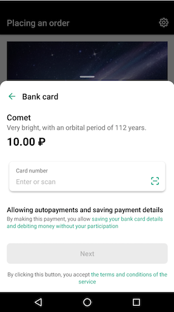
- `SavePaymentMethod.USER_SELECTS` - the user chooses whether or not to save the payment method. If the method can be saved, a toggle will appear on the selected payment method screen.<br/>
  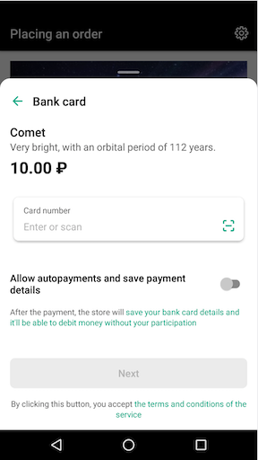

<details open>
  <summary>Kotlin</summary>

```kotlin
class MyActivity : AppCompatActivity() {

    fun startTokenize() {
        val paymentParameters = PaymentParameters(
            amount = Amount(BigDecimal.TEN, Currency.getInstance("RUB")),
            title = "Product name",
            subtitle = "Product description",
            clientApplicationKey = "live_thisKeyIsNotReal", // key for client apps from the YooMoney Merchant Profile (https://yookassa.ru/my/api-keys-settings)
            shopId = "12345", // ID of the store in the YooMoney system
            savePaymentMethod = SavePaymentMethod.ON, // flag of the disabled option to save payment methods
            authCenterClientId = "example_authCenterClientId", // ID received upon registering the app on the https://yookassa.ru website
            gatewayId = "gatewayId", // gatewayId of the store for Google Pay payments (required if payment methods include Google Pay)
            customReturnUrl = "https://custom.redirect.url", // url of the page (only https is supported) that the user should be returned to after completing 3ds. Must be used only when own Activity for the 3ds url is used.
            userPhoneNumber = "+79041234567", // user's phone number for autofilling the user phone number field in SberPay. Supported data format: "+7XXXXXXXXXX".
        )
        val intent = createTokenizeIntent(this, paymentParameters)
        startActivityForResult(intent, REQUEST_CODE_TOKENIZE)
    }
}
```
</details>

<details>
  <summary>Java</summary>

```java
class MyActivity extends AppCompatActivity {

    void startTokenize() {
        PaymentParameters paymentParameters = new PaymentParameters(
                new Amount(BigDecimal.TEN, Currency.getInstance("RUB")),
                "Product name",
                "Product description",
                "live_thisKeyIsNotReal", // key for client apps from the YooMoney Merchant Profile
                "12345", // ID of the store in the YooMoney system
                SavePaymentMethod.ON, // flag of the disabled option to save payment methods
                null, // the full list of available payment methods has been provided
                "gatewayId", // gatewayId of the store for Google Pay payments (required if payment methods include Google Pay)
                "https://custom.redirect.url", // url of the page (only https is supported) that the user should be returned to after completing 3ds. Must be used only when own Activity for the 3ds url is used.
                "+79041234567", // user's phone number for autofilling the user phone number field in SberPay. Supported data format: "+7XXXXXXXXXX"
                null, // settings for tokenization via GooglePay,
                "example_authCenterClientId" // ID received upon registering the app on the https://yookassa.ru website
        );
        Intent intent = Checkout.createTokenizeIntent(this, paymentParameters);
        startActivityForResult(intent, REQUEST_CODE_TOKENIZE);
    }
}
```
</details>

> After receiving the token for a recurring payment, make the payment and [follow the instructions](https://yookassa.ru/developers/payments/recurring-payments#process)

## Logging and mock mode configuration

#### Logging enabling

You may need to include logs in the sdk for the purposes of debugging. To do that, specify the `showLogs = true` parameter in `TestParameters` when launching tokenization

<details open>
  <summary>Kotlin</summary>

```kotlin
class MyActivity : AppCompatActivity() {

    fun startTokenize() {
        val testParameters = TestParameters(
            showLogs = true // showLogs - enable/disable display of sdk logs
        )
        val intent = createTokenizeIntent(this, paymentParameters, testParameters)
        startActivityForResult(intent, REQUEST_CODE_TOKENIZE)
    }
}
```
</details>

<details>
  <summary>Java</summary>

```java
class MyActivity extends AppCompatActivity {

    void startTokenize() {
        TestParameters testParameters = new TestParameters(
                true // showLogs - enable/disable display of sdk logs
        );
        Intent intent = Checkout.createTokenizeIntent(this, paymentParameters, testParameters);
        startActivityForResult(intent, REQUEST_CODE_TOKENIZE);
    }
}
```
</details>

> Please note that the logs will only be displayed in the debug app. Do not specify this flag for the release build of the app.

#### Mock mode configuration

The library has a mock mode which you can use to see what the SDK would look like with various inputs. This mode does not require Internet access. The received token can't be used for payment.

`MockConfiguration` class fields:
- `completeWithError` (Boolean) - tokenization always returns an error;
- `paymentAuthPassed` (Boolean) - whether the user is authorized to pay with a wallet or not;
- `linkedCardsCount` (Int) - number of cards linked to the user's wallet;
- `serviceFee` (Amount) - commission that will be displayed on the screen of the selected payment method;

To run tokenization in mock mode, specify the `mockConfiguration` parameter in `TestParameters`

<details open>
  <summary>Kotlin</summary>

```kotlin
class MyActivity : AppCompatActivity() {

    fun startTokenize() {
        val testParameters = TestParameters(
            showLogs = true, // showLogs - enable/disable display of SDK logs
            googlePayTestEnvironment = true, // googlePayTestEnvironment - what type of environment should be used for Google Pay, test or production. Learn more at https://developers.google.com/pay/api/android/guides/test-and-deploy/integration-checklist
            mockConfiguration = MockConfiguration(
                completeWithError = true, // completeWithError - always return an error during tokenization
                paymentAuthPassed = true, // paymentAuthPassed - whether the user is authorized to pay with a wallet or not
                linkedCardsCount = 3, // linkedCardsCount - number of cards linked to the user's wallet;
                serviceFee = Amount(BigDecimal.ONE, Currency.getInstance("RUB")) // serviceFee - commission that will be displayed on the screen of the selected payment method
            )
        )
        val intent = createTokenizeIntent(this, paymentParameters, testParameters)
        startActivityForResult(intent, REQUEST_CODE_TOKENIZE)
    }
}
```
</details>

<details>
  <summary>Java</summary>

```java
class MyActivity extends AppCompatActivity {

    void startTokenize() {
        MockConfiguration mockConfiguration = new MockConfiguration(
            true, // completeWithError - always return an error during tokenization
            true, // paymentAuthPassed - whether the user is authorized to pay with a wallet or not
            3,// linkedCardsCount - number of cards linked to the user's wallet;
            new Amount(BigDecimal.ONE, Currency.getInstance("RUB")) // serviceFee - commission that will be displayed on the screen of the selected payment method
        );
        TestParameters testParameters = new TestParameters(
                true, // showLogs - enable/disable display of SDK logs
                true, // googlePayTestEnvironment - what type of environment should be used for Google Pay, test or production. Learn more at https://developers.google.com/pay/api/android/guides/test-and-deploy/integration-checklist
                mockConfiguration
        );
        Intent intent = Checkout.createTokenizeIntent(this, paymentParameters, testParameters);
        startActivityForResult(intent, REQUEST_CODE_TOKENIZE);
    }
}
```
</details>

## Interface configuration

To customize the SDK interface, you can use the `UiParameters` object, namely set the main color of the interface and configure the display of the YooMoney logo on the screen with the list of payment methods (hide or show).

`UiParameters` class fields:
* showLogo (Boolean) - show or hide the YooMoney logo on the screen with the list of payment methods;
* colorScheme (ColorScheme) - mSdk color scheme in your app.

`ColorScheme` class fields:
* primaryColor (ColorInt) - the main color of the app. Buttons, switches, input fields, etc. will be switched to this color.
  We don't recommend making this color too light if your theme is already designed with light colors, as it won't be visible on a white background, or choose a dark color for a dark theme, since it won't be visible either. We also don't recommend using red as it might mix up with color of error messages.

  | With icon     | Without icon       |
    | ------------- |:------------------:|
  | 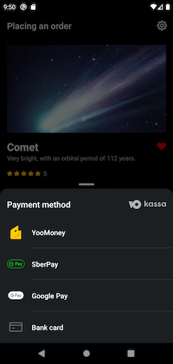     | 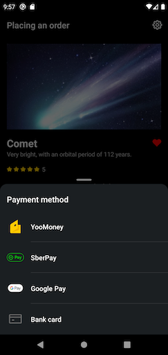   |

  | Correct custom color     | Incorrect custom color         |
    | ------------- |:------------------:|
  | 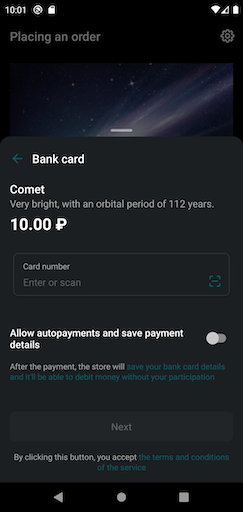     | 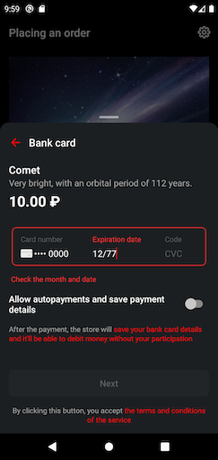   |

  <details open>
    <summary>Kotlin</summary>

  ```kotlin
  class MyActivity : AppCompatActivity() {

      fun tokenizeCustomUiParameters() {
          val paymentParameters = PaymentParameters(...)
          val uiParameters = UiParameters(
              showLogo = true,
              colorScheme = ColorScheme(Color.rgb(0, 114, 245))
          ) // specify the true flag so that the YooMoney logo is displayed on the screen with the list of payment methods and specify the ColorScheme that contains the custom color
          val intent = createTokenizeIntent(
              context = this,
              paymentParameters = paymentParameters,
              uiParameters = uiParameters
          )
          startActivityForResult(intent, REQUEST_CODE_TOKENIZE)
      }
  }
  ```
  </details>

  <details>
    <summary>Java</summary>

  ```java
  class MyActivity extends AppCompatActivity {

      void tokenizeCustomUiParameters() {
          PaymentParameters paymentParameters = new PaymentParameters(...);
          UiParameters uiParameters = new UiParameters(true, new ColorScheme(Color.rgb(0, 114, 245))); // specify the true flag so that the YooMoney logo is displayed on the screen with the list of payment methods and specify the ColorScheme that contains the custom color
          Intent intent = Checkout.createTokenizeIntent(
                  this,
                  paymentParameters,
                  null, // parameters for the test mode - enable logging/use mock data
                  uiParameters
          );
          startActivityForResult(intent, REQUEST_CODE_TOKENIZE);
      }
  }

  ```
  </details>

## Scanning a bank card

The sdk includes the option to connect a library for scanning bank cards with a camera. If you enable scanning, a special button will appear on the bank card number entry form :


When the user taps this button, the sdk will launch `intent` to launch `activity` that implements card scanning.
>Bank card scanning is not implemented in the sdk itself, the scanning is proposed to be implemented in `activity` via a third-party library instead.

To do that, create `activity` that will handle the `ru.yoomoney.sdk.kassa.payments.action.SCAN_BANK_CARD` action, then register this `activity` in `AndroidManifest.xml`, specifying `intent-filter` for the  `ru.yoomoney.sdk.kassa.payments.action.SCAN_BANK_CARD` action:
```xml
<activity android:name=".ScanBankCardActivity">

    <intent-filter>
        <action android:name="ru.yoomoney.sdk.kassa.payments.action.SCAN_BANK_CARD"/>
    </intent-filter>

</activity>
```

Now when you tap the card scanning button , your `activity` will be launched where you will need to implement the card scanning, then complete `activity` and specify the resuls using the `setResult` method.

To do that, before completing `activity`, call the `Checkout.createScanBankCardResult` method and specify the card number and optional month/year parameters, and send it to the `setResult` method. Then call the `finish()` method

<details open>
  <summary>Kotlin</summary>

```kotlin
class ScanBankCardActivity : Activity() {

    private fun onScanningDone(cardNumber: String, expirationMonth: Int, expirationYear: Int) {
        val result: Intent = Checkout.createScanBankCardResult(cardNumber, expirationMonth, expirationYear)
        setResult(RESULT_OK, result)
        finish()
    }
}
```
</details>

<details>
  <summary>Java</summary>

Java:
```java
class ScanBankCardActivity extends Activity {

    private void onScanningDone(final String cardNumber, final int expirationMonth, final int expirationYear) {
        final Intent result = Checkout.createScanBankCardResult(cardNumber, expirationMonth, expirationYear);
        setResult(Activity.RESULT_OK, result);
        finish();
    }
}
```
</details>

#### Example of `activity` implementation for scanning bank card details
Below you can find the example of bank card data scanning implemented via the third-party library card.io: https://github.com/card-io/card.io-Android-SDK
You can use any other library or solution that suits you.

<details open>
  <summary>Kotlin</summary>

```kotlin
class ScanBankCardActivity : Activity() {

    override fun onCreate(savedInstanceState: Bundle?) {
        super.onCreate(savedInstanceState)
        ActivityCompat.requestPermissions(this, arrayOf(permission.CAMERA), REQUEST_CODE)
    }

    override fun onRequestPermissionsResult(requestCode: Int, permissions: Array<String>, grantResults: IntArray) {
        super.onRequestPermissionsResult(requestCode, permissions, grantResults)
        if (requestCode == REQUEST_CODE) {
            if (grantResults[0] == PackageManager.PERMISSION_DENIED
                && !ActivityCompat.shouldShowRequestPermissionRationale(this, permission.CAMERA)
            ) {
                Toast.makeText(
                    this,
                    "Give permisson to use the camera in the settings",
                    Toast.LENGTH_SHORT
                ).show()
                finish()
            } else {
                val scanIntent = Intent(this, CardIOActivity::class.java)
                scanIntent.putExtra(CardIOActivity.EXTRA_REQUIRE_EXPIRY, true)
                startActivityForResult(scanIntent, REQUEST_CODE)
            }
        }
    }

    override fun onActivityResult(requestCode: Int, resultCode: Int, data: Intent?) {
        super.onActivityResult(requestCode, resultCode, data)
        if (requestCode == REQUEST_CODE) {
            if (data != null && data.hasExtra(CardIOActivity.EXTRA_SCAN_RESULT)) {
                val scanResult: CreditCard = requireNotNull(data.getParcelableExtra(CardIOActivity.EXTRA_SCAN_RESULT))
                val cardNumber = scanResult.formattedCardNumber
                if (scanResult.isExpiryValid && scanResult.redactedCardNumber != null
                    && scanResult.redactedCardNumber.isNotEmpty()
                ) {
                    val scanBankCardResult = createScanBankCardIntent(
                        cardNumber,
                        scanResult.expiryMonth,
                        scanResult.expiryYear % 100
                    )
                    setResult(RESULT_OK, scanBankCardResult)
                } else {
                    setResult(RESULT_CANCELED)
                }
            } else {
                setResult(RESULT_CANCELED)
            }
            finish()
        }
    }

    companion object {
        const val REQUEST_CODE = 1
    }
}
```
</details>

<details>
  <summary>Java</summary>

```java
public class ScanBankCardActivity extends AppCompatActivity {

    public static final int REQUEST_CODE = 1;

    @Override
    protected void onCreate(@Nullable Bundle savedInstanceState) {
        super.onCreate(savedInstanceState);
        ActivityCompat.requestPermissions(this, new String[]{ CAMERA }, REQUEST_CODE);
    }

    @Override
    public void onRequestPermissionsResult(int requestCode, @NonNull String[] permissions, @NonNull int[] grantResults) {
        super.onRequestPermissionsResult(requestCode, permissions, grantResults);

        if (requestCode == REQUEST_CODE) {
            if (grantResults[0] == PackageManager.PERMISSION_DENIED
                    && !ActivityCompat.shouldShowRequestPermissionRationale(this, CAMERA)
            ) {
                Toast.makeText(
                        this,
                        "Give permisson to use the camera in the settings",
                        Toast.LENGTH_SHORT
                ).show();

                finish();
            } else {
                Intent scanIntent = new Intent(this, CardIOActivity.class);
                scanIntent.putExtra(CardIOActivity.EXTRA_REQUIRE_EXPIRY, true);
                startActivityForResult(scanIntent, REQUEST_CODE);
            }
        }
    }

    @Override
    protected void onActivityResult(int requestCode, int resultCode, Intent data) {
        super.onActivityResult(requestCode, resultCode, data);

        if (requestCode == REQUEST_CODE) {
            if (data != null && data.hasExtra(CardIOActivity.EXTRA_SCAN_RESULT)) {
                CreditCard scanResult = data.getParcelableExtra(CardIOActivity.EXTRA_SCAN_RESULT);
                final String cardNumber = scanResult.getFormattedCardNumber();

                if (scanResult.isExpiryValid() && scanResult.getRedactedCardNumber() != null &&
                        !scanResult.getRedactedCardNumber().isEmpty()) {
                    final Intent scanBankCardResult = Checkout.createScanBankCardIntent(
                            cardNumber,
                            scanResult.expiryMonth,
                            scanResult.expiryYear % 100
                    );
                    setResult(RESULT_OK, scanBankCardResult);
                } else {
                    setResult(RESULT_CANCELED);
                }
            } else {
                setResult(RESULT_CANCELED);
            }
            finish();
        }
    }
}
```
</details>

# Useful links
* [YooMoney website](https://yookassa.ru)
* [Mobile SDK documentation on the YooMoney website](https://yookassa.ru/docs/client-sdks/#mobil-nye-sdk)
* [Google Play demo app](https://play.google.com/store/apps/details?id=ru.yoo.sdk.kassa.payments.example.release)
* [SDKs for iOS](https://github.com/yoomoney/yookassa-payments-swift)
